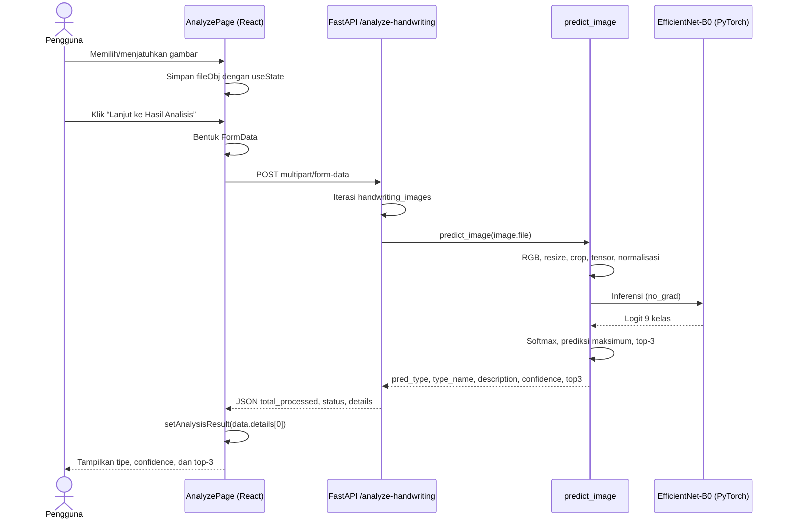

# Arsitektur Sistem Graphelp

Dokumen ini menjelaskan arsitektur berdasarkan implementasi kode yang tersedia saat ini. Istilah *catatan* dan *rekomendasi* menunjukkan observasi terhadap kode, bukan fitur yang diasumsikan telah tersedia.

## 1. Overview Arsitektur

Graphelp menerapkan arsitektur **client-server** berbasis web. Frontend berupa single-page application (SPA) React mengelola interaksi pengguna, formulir, dan tampilan hasil. Frontend berkomunikasi dengan backend FastAPI melalui REST API menggunakan `fetch`. Backend menangani dua area utama: autentikasi berbasis database serta prediksi gambar tulisan tangan menggunakan model PyTorch.

Untuk autentikasi, FastAPI menggunakan SQLAlchemy untuk mengakses tabel `users`. Pendaftaran dan pemulihan kata sandi menggunakan OTP yang dibuat serta disimpan sementara di memori proses; OTP dikirim melalui SMTP Gmail. Untuk prediksi, endpoint analisis menerima berkas gambar dalam `multipart/form-data`, meneruskannya ke `predict_image()`, lalu mengirim hasil prediksi kembali sebagai JSON.

Model AI, database, dan layanan SMTP diakses oleh backend, bukan langsung oleh frontend. Model EfficientNet-B0 beserta bobot lokal dimuat saat `predict.py` diimpor; tabel database dibuat saat `main.py` dimulai melalui `Base.metadata.create_all()`.

## 2. Diagram Arsitektur

```mermaid
flowchart LR
    U[Pengguna / Guru]

    subgraph FE[React Frontend]
        HP[Homepage]
        AP[AnalyzePage]
        SP[StudentPage]
        HY[HistoryPage]
        AU[Halaman autentikasi]
        LS[(localStorage: user)]
    end

    subgraph BE[FastAPI Backend]
        MAIN[main.py\n/analyze-handwriting]
        AUTH[auth.py\nEndpoint autentikasi]
        PRED[predict.py\npredict_image]
        SCHEMA[schemas.py\nValidasi Pydantic]
        UTIL[utils.py\nOTP & email]
        DBDEP[get_db()]
    end

    DB[(Database\nSQLAlchemy: users)]
    ML[PyTorch / Torchvision\nEfficientNet-B0 + .pth]
    SMTP[SMTP SSL Gmail\nport 465]

    U --> FE
    HP --> AP
    AP -->|POST multipart/form-data| MAIN
    SP -->|POST multipart/form-data| MAIN
    MAIN --> PRED
    PRED --> ML
    ML --> PRED
    PRED --> MAIN
    MAIN -->|JSON hasil| AP
    MAIN -->|JSON hasil| SP

    AU -->|JSON atau form-urlencoded| AUTH
    AUTH --> SCHEMA
    AUTH --> DBDEP
    DBDEP --> DB
    AUTH --> UTIL
    UTIL --> SMTP
    AUTH -->|data user login| LS
    HY -->|GET /analysis-history| BE
```

Panah dari `HistoryPage` ke backend menunjukkan pemanggilan yang dibuat frontend. Endpoint tersebut tidak ditemukan pada `main.py` atau `auth.py`; detailnya dijelaskan di bagian catatan teknis.

## 3. Backend Layer

### Routing dan Endpoint

`main.py` membuat objek `FastAPI`, menambahkan middleware CORS, membuat metadata tabel, lalu memasang `auth.router` tanpa prefix. Endpoint yang ditemukan adalah sebagai berikut.

| Method | Path | Fungsi | Request dan respons ringkas |
| --- | --- | --- | --- |
| `POST` | `/analyze-handwriting` | Menganalisis satu atau banyak gambar tulisan tangan. | Menerima `multipart/form-data`: metadata sekolah/kelas, daftar data siswa, dan daftar `handwriting_images`. Mengembalikan `total_processed`, `status`, dan `details` berisi nama, `pred_type`, `confidence`, serta `top3`. |
| `POST` | `/send-otp-register` | Memulai pendaftaran. | Body JSON `OTPRequest` (`email`). Memeriksa email, membuat/mengirim OTP, lalu mengembalikan pesan. |
| `POST` | `/register-with-otp` | Memverifikasi OTP registrasi dan membuat pengguna. | Body JSON `UserRegister`; query parameter `otp`. Mengembalikan pesan sukses atau HTTP 400. |
| `POST` | `/login` | Memverifikasi kredensial pengguna. | Form URL-encoded OAuth2 dengan `username` dan `password`. Mengembalikan pesan dan objek `user` tanpa password. |
| `POST` | `/forgot-password/send-otp` | Memulai reset kata sandi. | Body JSON `OTPRequest` (`email`). Memeriksa pengguna, membuat/mengirim OTP, lalu mengembalikan pesan. |
| `POST` | `/forgot-password/reset` | Mengubah kata sandi. | Body JSON `ResetPasswordRequest` (`email`, `otp`, `new_password`). Mengembalikan pesan sukses atau HTTP 400. |

#### Endpoint analisis

Endpoint `/analyze-handwriting` mendeklarasikan seluruh metadata sebagai field wajib, termasuk `school_name`, `grade_class`, `absence_numbers`, `student_names`, `ages`, dan `genders`. Untuk setiap item pada `handwriting_images`, fungsi mengambil indeks yang sama pada `absence_numbers` dan `student_names`, lalu memanggil `predict_image(image.file)`.

Hasil internal dari `predict_image()` berisi `pred_type`, `type_name`, `description`, `confidence`, dan `top3`. Namun, endpoint saat ini hanya memasukkan `pred_type`, `confidence`, dan `top3` ke respons `details`, bersama nama gabungan `No. <absen> - <nama>`.

### Auth Flow

#### Registrasi dengan OTP

1. Frontend mengirim email ke `POST /send-otp-register`.
2. `auth.py` memeriksa apakah email sudah ada di tabel `users`.
3. Jika belum ada, `generate_otp()` membuat angka acak enam digit. `auth.py` menyimpan `{code, type: "register"}` dengan email sebagai key pada `otp_storage`.
4. `send_otp_email()` mengirim kode tersebut melalui koneksi SMTP SSL Gmail.
5. Frontend membawa data formulir registrasi ke halaman verifikasi dan mengirim `UserRegister` bersama parameter query `otp` ke `POST /register-with-otp`.
6. Backend mencocokkan kode dan tipe OTP, melakukan hashing kata sandi dengan `pwd_context.hash()`, membuat objek `User`, menyimpannya, lalu menghapus OTP dari memori.

Untuk pengguna dengan `role == "guru"`, nilai `school_name`, `school_email`, dan `bukti_path` dari request disimpan. Untuk peran lain, ketiga nilai tersebut diisi `None` oleh backend.

#### Login

Frontend `LoginPage` mengirim `username` dan `password` dalam `application/x-www-form-urlencoded`. Dependency `OAuth2PasswordRequestForm` membaca form tersebut. Backend mencari pengguna berdasarkan username dan memverifikasi hash menggunakan `pwd_context.verify()`. Jika berhasil, backend mengembalikan data ringkas pengguna; frontend menyimpannya dalam `localStorage` dengan key `user`. Implementasi saat ini tidak membuat atau mengembalikan access token.

#### Reset kata sandi

`POST /forgot-password/send-otp` memastikan email ada, lalu membuat OTP bertipe `forgot` dan mengirimkannya melalui email. Pada `POST /forgot-password/reset`, backend memeriksa email, kode, dan tipe OTP terlebih dahulu. Jika valid, nilai `new_password` di-hash dan disimpan ke `User.password`, kemudian OTP dihapus.

`VerifyOtpForgotPage` di frontend hanya memeriksa panjang OTP sebelum meneruskan pengguna ke halaman reset; validasi OTP yang menentukan tetap dilakukan oleh endpoint reset backend.

### Database Layer

`database.py` memuat variabel lingkungan melalui `load_dotenv()`, membaca `DATABASE_URL`, lalu membuat komponen SQLAlchemy berikut:

- `engine = create_engine(DATABASE_URL)` sebagai koneksi utama.
- `SessionLocal` sebagai factory sesi dengan `autocommit=False` dan `autoflush=False`.
- `Base = declarative_base()` sebagai basis model ORM.

Model `User` dalam `models.py` dipetakan ke tabel `users`.

| Kolom | Tipe | Aturan |
| --- | --- | --- |
| `id` | `Integer` | Primary key dan index. |
| `username` | `String` | Wajib, unik, dan diindeks. |
| `email` | `String` | Wajib, unik, dan diindeks. |
| `password` | `String` | Wajib; menyimpan hash, bukan plaintext pada alur normal. |
| `role` | `String` | Default `public`. |
| `school_name` | `String` | Opsional. |
| `school_email` | `String` | Opsional. |
| `bukti_path` | `String` | Opsional. |

Fungsi generator `get_db()` dipakai sebagai dependency injection FastAPI (`Depends(get_db)`) di endpoint autentikasi. Ia membuat sesi sebelum handler berjalan dan selalu menutupnya dalam blok `finally`, sehingga lifecycle sesi tidak dikelola manual oleh setiap endpoint.

Tidak ada model atau tabel untuk sampel tulisan tangan, hasil prediksi, kelas, maupun riwayat analisis pada kode yang diperiksa.

### ML Inference Layer

`predict.py` menyusun dan memuat model sekali pada waktu impor modul:

1. `load_enneagram_model()` memilih perangkat CUDA jika tersedia; jika tidak, CPU.
2. Model dasar adalah `torchvision.models.efficientnet_b0` dengan bobot EfficientNet-B0 default apabila API bobot tersedia; fallback memakai `pretrained=True`.
3. Classifier bawaan diganti menjadi `Dropout(p=0.3)` dan `Linear(in_features, 9)`, sesuai sembilan kelas Enneagram.
4. Checkpoint `best_enneagram_model.pth` dimuat. Kode mendukung checkpoint berupa dictionary dengan key `model_state_dict` ataupun state dictionary langsung.
5. Model dipindahkan ke perangkat terpilih dan dipasang pada mode evaluasi (`eval()`).

Ketika `predict_image(image_file)` dipanggil, prosesnya adalah:

1. Membuka file dengan Pillow dan mengonversinya ke RGB.
2. Menerapkan transformasi: `Resize((256, 256))`, `CenterCrop(224)`, `ToTensor()`, dan normalisasi mean/std ImageNet.
3. Menambahkan dimensi batch, memindahkan tensor ke perangkat, lalu menjalankan inferensi di dalam `torch.no_grad()`.
4. Menerapkan `softmax`, menentukan indeks probabilitas maksimum, dan mengonversi indeks nol-based menjadi tipe 1–9.
5. Menyusun tiga probabilitas tertinggi dengan nama dari `ENNEAGRAM_INFO`.

Nilai keluaran fungsi adalah:

| Field | Makna |
| --- | --- |
| `pred_type` | Nomor tipe Enneagram 1–9 dengan probabilitas tertinggi. |
| `type_name` | Nama tipe dari `ENNEAGRAM_INFO`. |
| `description` | Deskripsi tipe dari `ENNEAGRAM_INFO`; saat ini nilainya placeholder `"..."`. |
| `confidence` | Probabilitas kelas teratas dalam persen. |
| `top3` | Tiga kandidat teratas berisi `type`, `name`, dan `prob` dalam persen. |

### Validation Layer

`schemas.py` menggunakan Pydantic untuk memvalidasi body JSON pada sebagian endpoint autentikasi:

| Schema | Digunakan oleh | Field |
| --- | --- | --- |
| `UserRegister` | `/register-with-otp` | `username`, `email: EmailStr`, `password`, `role`, dan data sekolah opsional. |
| `OTPRequest` | Endpoint kirim OTP | `email: EmailStr`. |
| `ResetPasswordRequest` | `/forgot-password/reset` | `email: EmailStr`, `otp`, `new_password`. |
| `UserLogin` | Tidak direferensikan endpoint saat ini | `username`, `password`. |
| `UserResponse` | Tidak direferensikan endpoint saat ini | `id`, `username`, `email`, `role`; `from_attributes=True`. |
| `OTPVerify` | Tidak direferensikan endpoint saat ini | `email`, `otp`. |

Request analisis tidak memakai schema Pydantic; validasinya bergantung pada deklarasi parameter `Form`, `File`, dan tipe `List[str]` di FastAPI.

## 4. Frontend Layer

### Halaman dan Komponen

| Halaman/komponen | Peran dalam arsitektur |
| --- | --- |
| `Homepage` | Halaman informasi/landing. Menggunakan hook `useRevealOnScroll`, `IntersectionObserver`, dan asset gambar. Tidak memanggil backend. Tombol “Mulai Analisis” belum memiliki handler navigasi pada file ini. |
| `AnalyzePage` | Antarmuka analisis personal. Tab unggah foto terhubung ke backend dan menampilkan hasil. Tab tulis manual serta kamera menyediakan UI, namun belum memanggil endpoint analisis. |
| `SignaturePad` | Komponen internal `AnalyzePage` yang menggambar pada `<canvas>` menggunakan Pointer Events. Mendukung pena, penghapus, ukuran goresan, dan hapus kanvas. Data kanvas belum dikonversi/dikirim ke backend. |
| `CameraView` | Komponen internal `AnalyzePage` yang meminta izin kamera melalui `navigator.mediaDevices.getUserMedia`, memotong frame persegi ke canvas, lalu menghasilkan data URL PNG. Hasil tangkapan belum dikirim ke backend. |
| `HistoryPage` | Antarmuka riwayat untuk role `guru`. Membaca `user` dari `localStorage`, melakukan pengecekan role di sisi klien, dan mencoba mengambil riwayat. |
| `StudentPage` | Halaman tambahan yang dirutekan pada `App.jsx` untuk role `guru`; membentuk data banyak siswa dan mengirimkannya ke endpoint analisis yang sama. |
| Halaman auth | `LoginPage`, `RegisterPage`, halaman OTP, dan reset password memanggil endpoint autentikasi FastAPI serta menyimpan data login pada `localStorage`. |

`App.jsx` menggunakan `BrowserRouter` dan mendefinisikan route untuk halaman publik, autentikasi, analisis, siswa, dan riwayat. `Navbar` menampilkan tautan `Student` dan `History` bila objek user pada `localStorage` memiliki `role === "guru"`.

### Komunikasi Frontend ke Backend

Semua URL backend pada frontend yang diperiksa ditulis langsung sebagai `http://localhost:8000`.

| Pemanggil | Endpoint | Format data |
| --- | --- | --- |
| `AnalyzePage.handleAnalyze` | `POST /analyze-handwriting` | `FormData`: nilai placeholder untuk metadata satu orang, lalu satu file dengan key `handwriting_images`. |
| `StudentPage.handleAnalyze` | `POST /analyze-handwriting` | `FormData`: metadata sekolah/kelas dan field berulang untuk setiap siswa/file. |
| `LoginPage` | `POST /login` | `URLSearchParams`, header `application/x-www-form-urlencoded`. |
| `RegisterPage` | `POST /send-otp-register` | JSON `{ email }`. |
| `VerifyOtpPage` | `POST /register-with-otp?otp=...` | JSON data `UserRegister`. |
| `ForgotPasswordPage` | `POST /forgot-password/send-otp` | JSON `{ email }`. |
| `ResetPasswordPage` | `POST /forgot-password/reset` | JSON `email`, `otp`, `new_password`. |
| `HistoryPage` | `GET /analysis-history?user_id=...` | Tidak ada body. Endpoint belum ditemukan di backend. |

### State Management

State lokal dikelola dengan hook React `useState` dan efek samping/akses perangkat menggunakan `useEffect`. Contohnya, `AnalyzePage` menyimpan tab aktif, file, status loading, hasil, status drag, dan status kamera; `HistoryPage` menyimpan daftar serta status loading.

Tidak ditemukan library state management global. Informasi login disimpan di `localStorage` dengan key `user`, lalu dipakai frontend untuk tampilan navigasi serta pembatasan UI halaman guru. React Router digunakan untuk perpindahan halaman dan membawa data sementara melalui `location.state` pada alur OTP.

## 5. Alur Data End-to-End

Diagram berikut menunjukkan alur unggah file yang sudah terhubung dari `AnalyzePage` ke backend.



Catatan: respons `details` dari `main.py` tidak meneruskan `type_name` dan `description`, walaupun `AnalyzePage` mencoba membacanya. Karena itu, bagian tersebut dapat bernilai `undefined` pada tampilan saat ini.

## 6. Keamanan

### Mekanisme yang ada di kode

- Kata sandi di-hash dengan `passlib.context.CryptContext` yang dikonfigurasi untuk `pbkdf2_sha256` dan `bcrypt`; login menggunakan `verify()` terhadap hash tersimpan.
- Registrasi dan reset kata sandi memerlukan kecocokan kode OTP, email, dan jenis proses (`register` atau `forgot`) sebelum perubahan data dilakukan.
- Kredensial database dan SMTP dibaca dari environment variable (`DATABASE_URL`, `SMTP_EMAIL`, `SMTP_PASSWORD`) melalui `.env`, bukan ditulis langsung di source code.
- `get_db()` menutup sesi database pada blok `finally`.

### Observasi dan rekomendasi

Bagian berikut adalah catatan keamanan berdasarkan implementasi saat ini, bukan klaim bahwa fitur tersebut sudah tersedia.

- CORS mengizinkan semua origin (`allow_origins=["*"]`) beserta method dan header. Untuk deployment, pertimbangkan daftar origin yang eksplisit dan sesuai domain frontend.
- `otp_storage` adalah dictionary in-memory: data OTP hilang ketika proses backend restart, tidak dibagikan antar instance, dan tidak memiliki waktu kedaluwarsa eksplisit. Penyimpanan bersama dengan TTL, misalnya database atau cache, dapat dipertimbangkan.
- OTP dibuat memakai `random.randint()`. Untuk kode keamanan, generator kriptografis seperti modul `secrets` layak dipertimbangkan.
- Login mengembalikan objek user tetapi tidak menerbitkan token/sesi server. Pengecekan peran `guru` yang terlihat berada di frontend; endpoint analisis sendiri tidak memeriksa autentikasi atau otorisasi.
- Tidak tampak pembatasan percobaan OTP/login, validasi tipe/ukuran file gambar, ataupun penanganan kesalahan khusus untuk file gambar tidak valid pada kode yang diperiksa.
- Parameter query `otp` pada pendaftaran dapat tercatat dalam riwayat URL atau log. Pengiriman OTP dalam body HTTPS dapat dipertimbangkan bila alur diubah.

## 7. Batasan dan Catatan Teknis

- **Catatan integrasi riwayat:** `HistoryPage.jsx` memanggil `GET /analysis-history?user_id=...`, sedangkan endpoint tersebut tidak ditemukan pada `main.py` maupun `auth.py`. Saat request gagal, halaman mengisi dua data contoh di sisi klien. Tidak ditemukan tabel atau model riwayat analisis.
- **Catatan konfigurasi API:** URL `http://localhost:8000` ditulis langsung dalam beberapa halaman frontend. Konfigurasi berbasis environment akan diperlukan bila frontend dan backend berada pada host/port lain.
- **Catatan kontrak respons:** `predict_image()` membuat `type_name` dan `description`, tetapi `main.py` tidak meneruskan keduanya ke `details`. `AnalyzePage` dan `StudentPage` mencoba menampilkannya.
- **Catatan kelengkapan input:** `school_name`, `grade_class`, `ages`, dan `genders` diterima oleh endpoint analisis, namun tidak dipakai pada prediksi maupun disimpan oleh backend saat ini.
- **Catatan keselarasan daftar:** Endpoint mengakses `absence_numbers[i]` dan `student_names[i]` untuk setiap gambar tanpa pemeriksaan jumlah elemen. Frontend membentuk daftar secara paralel, tetapi kontrak API perlu menjaga jumlah field tetap konsisten.
- **Catatan fitur UI:** `SignaturePad` dan `CameraView` menghasilkan input di browser, tetapi belum menyalurkan hasilnya ke endpoint prediksi. Tab upload file adalah alur `AnalyzePage` yang sudah tersambung.
- **Catatan validasi OTP di UI:** halaman verifikasi OTP lupa kata sandi tidak menghubungi server; validasi sesungguhnya baru terjadi pada endpoint reset. Hal ini tetap aman di sisi keputusan backend, tetapi pengalaman pengguna dapat berbeda dari label halaman “Verifikasi”.
- **Catatan metadata model:** `ENNEAGRAM_INFO` menyimpan deskripsi placeholder `"..."`. Nama tipe dipakai pada top-3, namun deskripsi belum memiliki konten informatif.
- **Catatan siklus hidup model:** Model dimuat saat import `predict.py`. Ini menghindari pemuatan ulang per request, tetapi membuat startup backend bergantung pada keberadaan file bobot dan ketersediaan dependensi PyTorch.
